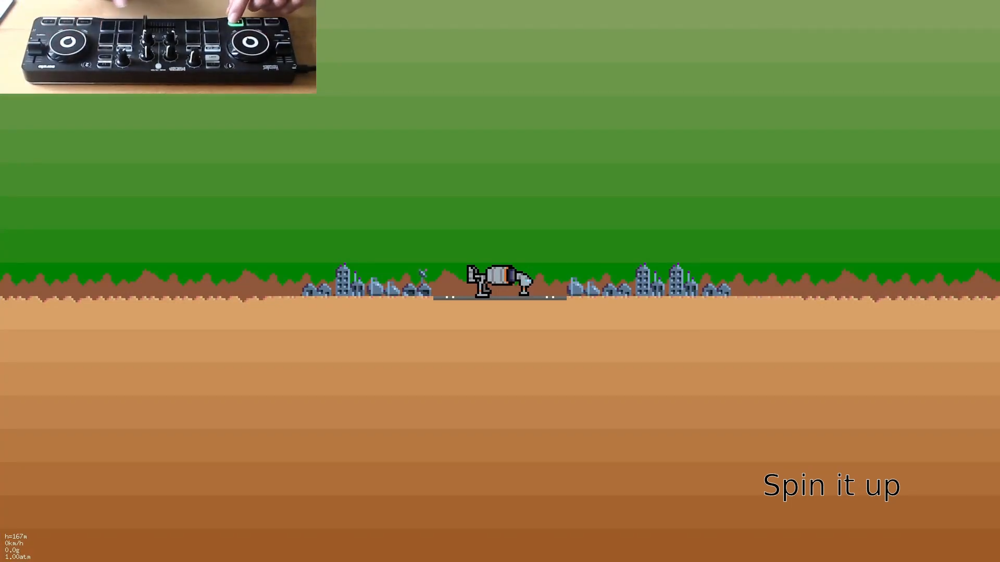
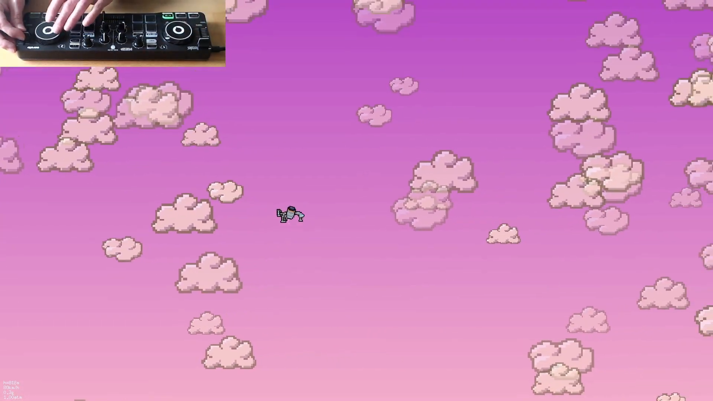

## Installation

Gameplay: [https://www.youtube.com/watch?v=LzHqutkuW90](https://www.youtube.com/watch?v=LzHqutkuW90)




BTW it has such specific requirements, I think my setup is the only computer in the world that can run this :-) This is because this game is just a toy golang program.

# Pointless features

* MIDI control of the craft using a DJ controller
* Live-syntehsised engine, air and radio noises
* "CB radio" with squelch
* SFX created using analog synthesiser ([presets for Uno Synth](./uno_sources))
* Clouds, space, and hidden modem sounds!

# Compilation on mac

Compile https://gitlab.com/gomidi/midicat and copy it to PATH (this is for windows compat) - also see the driver at https://gitlab.com/gomidi/midicatdrv.

Then go build this.

Or cross-compile for windows on macOS:

```
brew install mingw-w64
CC=x86_64-w64-mingw32-gcc GOOS=windows GOARCH=amd64 CGO_ENABLED=1 go build -o warryall.exe
```
